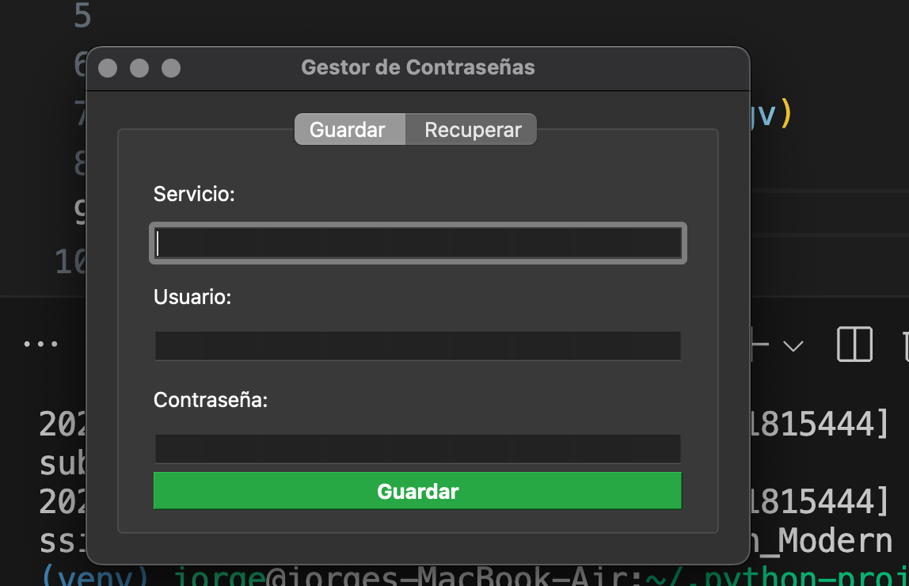

# 🔐 Password Manager

A professional and secure password manager built with Python and PyQt6. This application provides a user-friendly interface for storing and retrieving passwords using strong encryption methods.



## 🌟 Features

- Secure password storage using Fernet encryption
- Modern and intuitive graphical user interface
- Add and retrieve password entries
- Separate username and password storage
- Data encryption at rest
- Clean and maintainable code structure

## 🏗️ Project Structure

```plaintext
password-manager/
├── README.md
├── requirements.txt
├── src/
│   ├── __init__.py
│   ├── main.py
│   ├── models/
│   │   ├── __init__.py
│   │   └── password_manager.py
│   └── gui/
│       ├── __init__.py
│       └── main_window.py
└── data/
    ├── passwords.json
    └── secret.key
```

## 🔧 Requirements

- Python 3.x
- PyQt6
- cryptography

## 📥 Installation

1. Clone the repository:

    ```bash
    git clone https://github.com/your-username/password-manager.git
    cd password-manager
    ```

2. Create a virtual environment (recommended):

    ```bash
    python -m venv venv
    source venv/bin/activate  # Linux/macOS
    # or
    venv\Scripts\activate     # Windows
    ```

3. Install dependencies:

    ```bash
    pip install -r requirements.txt
    ```

## 🚀 Usage

Run the application:

```bash
python src/main.py
```

### Adding a Password

1. Select the "Guardar" tab
2. Enter the service name (e.g., "Gmail")
3. Enter the username
4. Enter the password
5. Click "Guardar"

### Retrieving a Password

1. Select the "Recuperar" tab
2. Enter the service name
3. Click "Recuperar"
4. View the credentials in the popup window

## 🔒 Security Features

- **Encryption**: Uses Fernet (symmetric encryption) for secure password storage
- **Key Management**: Encryption keys are stored separately from the password database
- **Data Protection**: Passwords are never stored in plain text
- **Secure Display**: Passwords are masked in the input field

## 📁 Code Organization

- `src/main.py`: Application entry point
- `src/models/password_manager.py`: Core password management logic
- `src/gui/main_window.py`: GUI implementation
- `data/`: Storage directory for encrypted passwords and keys

## ⚠️ Important Notes

- Keep your `secret.key` file safe and secure
- Lost encryption keys cannot be recovered
- Regular backups of both `passwords.json` and `secret.key` are recommended

## 🔄 Development

To contribute to this project:

1. Fork the repository
2. Create a feature branch
3. Make your changes
4. Submit a pull request

## 📞 Contact

Jorge Alberto Quiroz Sierra - [LinkedIn](https://www.linkedin.com/in/jorgealqs/) - [joralquisi@hotmail.com](mailto:joralquisi@hotmail.com) - [WhatsApp](https://wa.me/573193662738?text=Hola%20Jorge,%20me%20interesa%20hablar%20contigo)

## 📝 License

This project is licensed under the MIT License - see the file for details.

## 👥 Contributing

Contributions are welcome! Please feel free to submit a Pull Request.

## 🐛 Bug Reports

If you discover any bugs, please create an issue in the GitHub repository.
